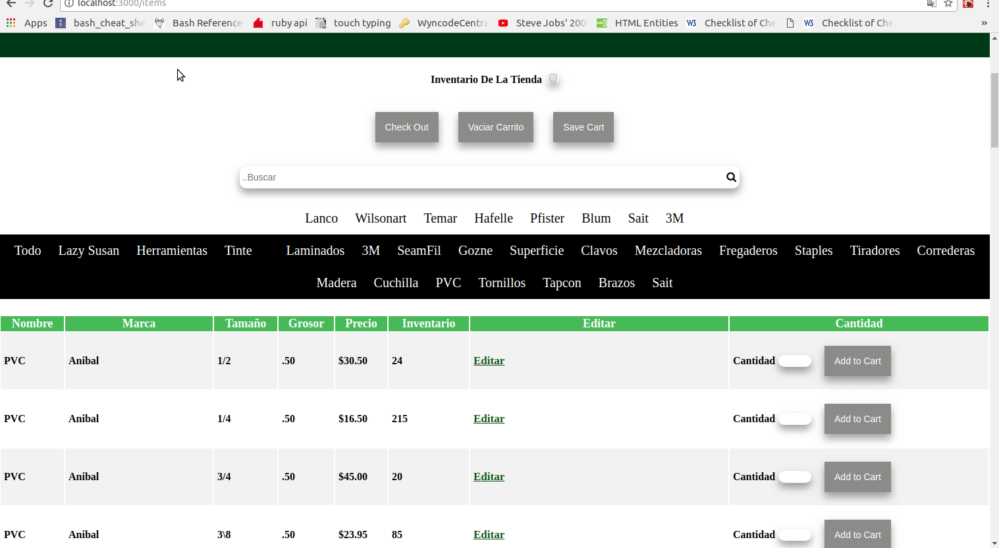

## Technologies Used

- Ruby on Rails
- ReactJS
- SCSS
- Devise
- PostgreSQL

## 1. Signing-In For Admin Roles

By Signing in you get certain Admin rights such as creating, editing and deleting items and orders. You can also see the reports like the Store Inventory, daily and weekly reports in the Orders page etc..

## 2. Creating New/Custom Items

New Store Item: When creating a new item you will choose Active(default) or InActive this is for Store-Inventory purpose. You then give it a Name, Category, Brand, Size, Thickness, Color, Sold-Price, Bought-Price, Inventory, Item-Number and add a Picture to the Item; All if applicable.

Custom Item: You will have the option to create Custom-Items only in the Carts of the Order your working on. To achive this you click the Create-item button in the cart table,three input spaces will pop up. One for the name, price and quantity.
Once you have entered the information you then click Add To Cart and the Custom-Items Price and Quantity will be factored in to the Carts total amount.

## 3. Creating An Order

- Choose items and quantity to be sold.
- When your done choosing all of the items you then proceed to checkout and there you will see the items, items-price, amount of items you selected and the subtotal amount for each item.
- You will have options to create custom-items, add more items, clear the cart or save the cart for later use.
- Once satisfied with the Order/Cart you then put a name(mandatory) to the order, a telephone number(optional) and select payment type. Once you Print Reciept the cart will be saved in Orders and page will refresh to homepage.

## 4. Finding, Editing And Deleting Orders

On top of the Homepage you will see the menu bar saying hello to the user with the links Orders, Create New Item, HomePage, Edit-Profile, and LogOut.

- Go to Orders link and you will see Dates and it will be current date by default.
- Able to Print Orders Page.
- You can search for your order through the Name or Order Number in the search bar.
- Select your dates and you will see three tables: One for all the orders between those dates, all refunded orders and total amount of cash, credit, debit, check, refunds, subtotal, taxes and total of all orders between those dates.

You can then select one of the orders by clicking on the link in the Date and Time column. In here:

- It displays all the items sold, original/refunded subtotal, total and tax amount.
- You can edit the form of payment
- Delete the entire order Itself
- Print a copy of the order
- Refund items in the order

When you click the refund button for one of the items it will render you to another page which will display the name, price, quantity sold and amount sold for this item. Most importantly it will have one input box for the amount of this item you will like to return. After you click Update, it will render you back to the order and highlighted in yellow it will tell you the refunded amount.
